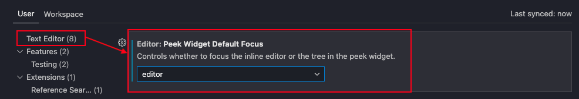

# Peek Imports

A Visual Studio Code extension that lets you peek and modify import statements without leaving the line you're working on.


## How to use

1. Anywhere in a code file, use the command `Peek Imports` (`ctrl+i`).
2. A Peek Window will open at your current position, but it will contain the import statements at the top of the file. The cursor should be set at the first line after the last import statement.
3. Insert a new import statement or modify an existing one, then press Escape to close the Peek Window and continue writing code where you left of.

### Keybindings

- `ctrl+i`: Executes the `Peek Imports` command. The command's ID is `peekimports.peekImports` if you want to configure other keybindings.

Example:

```
// keybindings.json
{
  "key": "ctrl+i",
  "command": "peekimports.peekImports"
}
```

## Caveats

- Only works in javascript and typescript files (for now).
- Only works for `import` statements, not `require` (it looks for lines that starts with the word "import" with no leading whitespace).

## Options

### Fix the Peek Window's default focus

By default when the Peek Window opens, the right-hand side menu is in focus. This is annoying because then you have to move your hand over to your mouse and use the mouse to set the cursor where you want to insert a new import statement in the left-hand editor panel.

To change it so that the left-hand editor panel is in focus by default, go to `Preferences: Open User Settings` and under `Text Editor` change the setting `Peek Widget Default Focus` to be `editor`.



If you use any VSCode feature that also rely on the Peek Window, such as Show References or Peek Definitions, this might interfere with your expected behaviour so decide for yourself how you want focus to be handled.
